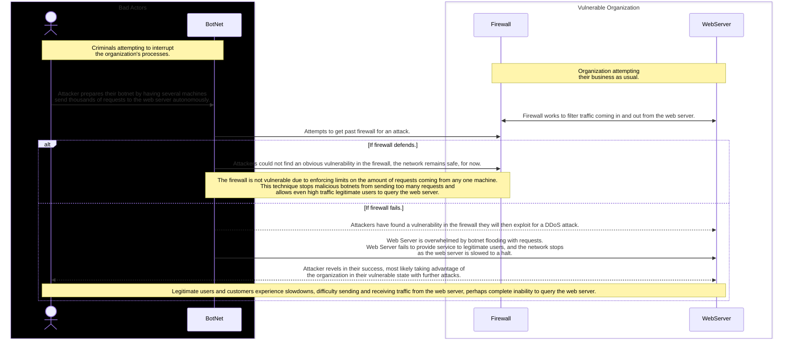

```mermaid
sequenceDiagram
actor A as Attacker
participant B as BotNet
participant F as Firewall
participant W as WebServer

Note over A,B: Criminals attempting to interrupt<br/> the organization's processes.
Note over F,W: Organization attempting<br/> their business as usual.

A ->> B: Attacker prepares their botnet by having several machines<br/> send thousands of requests to the web server autonomously.
F <<->> W: Firewall works to filter traffic coming in and out from the web server.

B ->> F: Attempts to get past firewall for an attack.
alt If firewall defends.
  B ->> F: Attackers could not find an obvious vulnerability in the firewall, the network remains safe, for now.
Note over B,F: The firewall is not vulnerable due to enforcing limits on the amount of requests coming from any one machine.<br/> This technique stops malicious botnets from sending too many requests and <br/>allows even high traffic legitimate users to query the web server.
else If firewall fails.
  B -->> W: Attackers have found a vulnerability in the firewall they will then exploit for a DDoS attack.
  B ->> W: Web Server is overwhelmed by botnet flooding with requests.<br/> Web Server fails to provide service to legitimate users, and the network stops <br/>as the web server is slowed to a halt.
  W <<-->> A: Attacker revels in their success, most likely taking advantage of <br/>the organization in their vulnerable state with further attacks.
Note over A,W: Legitimate users and customers experience slowdowns, difficulty sending and receiving traffic from the web server, perhaps complete inability to query the web server.
end


box Black Bad Actors
actor A
participant B
end
box Transparent Vulnerable Organization
participant F
participant W
end
```

